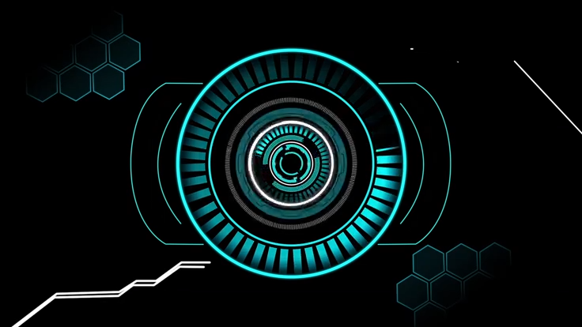

<!-- Header -->
<h1 align="left">👋 Hi there, I'm <strong>Nagamahesh Kendole</strong></h1>

<!-- Banner (replace with your own banner in ./assets/banner.png) -->

  

<!-- Socials -->

  
  
  

---

<!-- About section in two columns -->
<table>
  <tr>
    <td valign="top" width="65%">
      
### 👨‍💻 About Me

- 🎓 B.E in Computer Science & Engineering (2022–2026)  
- 💡 Passionate about solving real-world problems with tech  
- 🌱 Currently learning **Development, LLM, and Deep Learning**  
- 🎯 Goal: Building innovative solutions that make a positive impact  
- ⚡ Fun fact: When I’m not coding, I enjoy sketching, trekking, biking, or diving into a good book  

> I’m a software engineer & full stack developer, exploring AI, ML, and web development to create meaningful solutions.

    </td>
    <td valign="top" width="35%">
      
    </td>
  </tr>
</table>

---

### 🚀 Tech Stack

  <!-- Languages -->
  
  
  
  
  <!-- ML / DL -->
  
  

  <!-- Web -->
  
  

---

### 📊 GitHub Stats

  
  

---

⭐️ From [Nmkendole](https://github.com/Nmkendole)
